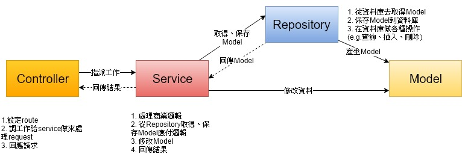

# 📌置頂

|  (8/14)更新  |                             連結                             |
| :----------: | :----------------------------------------------------------: |
|   一般連結   | ◾️[文檔連結](https://fbhobgw9mz3tfjnazgehbw-on.drv.tw/p0o9i8u7y6t5r4e3w2q1/documentation/)  ◾️[原始碼](https://drive.google.com/file/d/1m943mstT4WDGOH-e_Ef2o9z9JUAkf7vv/view?usp=sharing) |
|   目錄連結   | ◾️[公告](#📢公告) ◾️[架構作法](#🎡架構作法) ◾️[運作方式](#🚀運作方式) ◾️[檔案結構](#📁檔案結構) ◾️[架構待完成](#💻架構待完成) ◾️[功能進度](#🧾功能進度) |
| github內連結 | ◾️[公告](#公告) ◾️[架構作法](#架構作法) ◾️[運作方式](#運作方式) ◾️[檔案結構](#檔案結構) ◾️[架構待完成](#架構待完成) ◾️[功能進度](#功能進度) |

* 目前大部分function 以實作完，之後會以前端為主
* 想要運作請看 運作方式
* 若成功讓server啟動，可到 http://localhost:3000/api 查看可用的route

# 📢公告

### 8/16

* 設定一個global route prefix 'api'
  * `http://localhost:3000/user/login` -> `http://localhost:3000/api/user/login` 
* 加上一點 function 給前端用

<strong>...其他公告...</strong>

### 8/14

* 解決一堆bug
* 加上 角色權限 與 學期課程 權限的保護
* 更新資料庫模板
* 部份加上test controller，可以繞過登權限保護 

### 8/6

* 權限部份初步完成 (未測試，前端可行再加)
* 大部分功能已實作但未測試，之後會優先處理前端
* 加上 swagger ，可以查看可用 route 

### 8/5

* 新增SemesterCourseRepository 的 insert, update (目前save有bug，還沒找到原因)
* pipe改用內建的、一些錯誤的修正
* Booking 、card module的程式碼初步完成 (未測試)

### 8/3、8/4

* Schedule Change 從一節一個，改成一天一個
  
  * 原先是想說要可以用細到節次查詢，但覺得太瑣碎了，所以改成一天一個
  
* Schedule 加上`學期`跟`學年度`，不然無法兩學期schedule共存
  * 讓Semeseter Course 保存時生成Schedule
  * ScheduleUtil.parseSchedules增加year, semester的參數
  
* 更正時間呈現`-` 改成 `~`

  > e.g. [1]2-3 -> [1]2~3 

* 初步加上 pipe 跟 guard

### 8/2

* 修改semester course 資料
* 新增semester course repository來簡化save過程
  * 因為自定義的id無法讓save正確運作 (save 是靠id來查詢資料庫有無存在資料，不存在就insert，存在就更新 )
* 增加課程爬蟲，是為了方便測試，可 import 108學年度第一學期的 課程

### 8/1

* 去除setter getter，避免使用typeorm api時，得到不預期的結果
* 去除DatePeriod （因為都沒用到）

### 7/28

* 更新 SemesterCourseModule，目前已經可以運作🎉🎉🎉    (當然還有要修改部份，但可以玩玩)
  * 想玩請讀下面"運作方法"的說明
  * semester course module加了很多不必要的console訊息，之後會刪除
* ScheduleChange 新增一個 成員 personID, 停課保存執行人id，補課申請成功保存申請人id
* SemesterCourse 還是在資料庫內增加 year, semester, dept, serial

### 7/26

* BookingForm, MakeupCourseForm 的流水號為成員 formID，目前是八位數，兩碼英文加上申請序號，

  > `BFxxxxxx`, or `MFxxxxxx`

* model修正、資料庫樣板更新(沒有新增測試資料)

* ScheduleUtil修改完畢

### 7/24

* 已修正只回傳第一行結果的bug，目前model已經可以運作

### 7/23

* ~~typeorm目前可以運作，但不知謂何都永遠回傳資料表第一行的結果    `bug`~~
* 請注意，我將ScheduleUtil和constant-manager移到util資料夾
* 因為typeorm可接受的寫法，setter, getter改成依照typescript的標準寫法
* 我有改一些常數，如Period現在是以Array形式呈現

## 舊的公告

* 現在到處都是漏洞，尤其controller、service，請小心
* 你們寫好可以傳給我，或直接commit都可以

# 🎡架構作法

* 參考nestjs結構，自己隨手畫的，參考參考就好，說不定很多錯

# 🚀運作方式

## 前置作業

#### 安裝依賴包

1. 下載此project程式碼，可以直接下載或是用 git 下載

2. 在此project根目錄執行 `npm install` 安裝依賴包

   > 注意：每次我更新檔案，可能新增一些依賴包，所以最好更新後再安裝一遍依賴包

#### 資料庫匯入

1. 安裝mysql (或是 phpmyadmin)

   * 我是直接用 uwamp ，裡面包括phpmyadmin，可以免安裝、操作簡單
   
2. 建立一個 seminar-project 的資料庫

   > 名字可以隨意改，但測試時ormconfig.json必須做相應調整
   >

3. 匯入 seminar-project.sql 即可使用

* seminar-project.sql 資料填得不多，沒有每一個table都填
* 注意資料庫匯出最好`只匯出資料部份`就好，不要包含結構
  * typeorm會自動更正資料庫結構
  * typeorm跟mysql都有點刁鑽，全匯出會失掉一部分結構，匯入又有問題
  * 要全部匯出就要去掉 create time的 default值與foreign key再匯出

#### ormconfig.json設定

* https://typeorm.io/#/using-ormconfig
* 記得 username、password、database可能需要修改

## 開始運作

#### (1) 一般方式

1. 啟動好mysql（或 uwamp、phpmyadmin)
2. project根目錄下執行 `npm run start`
   * 此處會花較久時間
3. 可以開始玩了🎉 ，出現任何問題，可以問我

#### (2) 快速啟動 (第一次還是不會快)

1. 修改ormconfig.json，將entities部份的"src"改成"dist"
2. 運行 npm run start:dev 即開始運作

* 若要照一般方式啟動，記得將 ormconfig.json改回來

## 要運作自己部份

* 設定 route (自己查)
* 在app module裡面將要測試的module解除註解，即可依上面方法開始運作

# 📁檔案結構

- model/    -- 放置基本的Class
  - entity/    -- 放置會存在資料庫的class
  - common/    -- 放置其他的Class
  - repository/    -- 放置自定義的Repository
- module/   -- 放置功能性區分的controller與service
- util/    -- 放置一些輔助性class，這些Class不需要建立物件即可使用
  - constant-manager    -- 常數區域
- ormconfig.json    -- 資料庫設定
- seminar-project.sql    -- 目前的資料庫樣板，資料填得不多

# 💻架構待完成

* [ ] 資料回傳方式？？？

* [ ] 一些錯誤的包裝 (try, catch)

* [ ] 安全性加密

  * [ ] 密碼加密 (bcrypt)

* [ ] 權限管理

  * 使用 session 管理

  > 可參考 https://dev.to/nestjs/authentication-and-sessions-for-mvc-apps-with-nestjs-55a4

* [ ] nestjs架構相關

  > 可參考 https://github.com/lujakob/nestjs-realworld-example-app

  * [ ] controller and service

    * controller 要呼叫 service 來處理商業邏輯
  * [x] servcie and repository

    * Service 利用 repository 來取、保存 各種 Model 物件
  * [x] route設定 與 controller 參數的更正
    * 一些使用者相關參數可從 request 獲取，即可簡化 route 路徑
  * [x] pipe

    * 改使用內建
  * [x] guard
  
* [ ] Model

  * [x] 初步可以與typeorm運作

  * [x] 讓typeorm可以回傳正確的結果 (目前永遠回傳資料表第一行的結果)  `bug`

  * [ ] 流水號的規定

  * [x] 依序確認entity是否有bug

  * [x] IRoomSchedule interface的實做

    > 用來處理Schedule, ScheduleChange, 兩個Form, 轉換成 ClassroomDateSchedule的規定
    >
    > 不全部寫在ClassroomDateSchedule是為了讓我自己覺得code好看

  * [ ] entity 一些 function

    * [ ] 有些參數讀取或是保存時，需要經過特殊處理

* [ ] Util

  * [x] ScheduleUtil 的更正

* [ ] 細部邏輯沒考慮到

  > ClassScheduleManger, EquipmentManager, ...
  >
  > 一堆一定要實作的function沒有列到

# 🧾功能進度

- [ ] 帳號管理 

  - [ ] 帳號申請（助教）-- UserController.signupTA

  - [ ] 查看個人資料 -- UserController.findOne

  - [ ] 修改個人資料 -- UserController.update(?)

  - [ ] 修改密碼 -- UserController.updatePassword(?) 

    > 有需要跟修改個人資料合併嗎?

- [ ] 教室可借用時段 -- Schedule.findClassroomWeekSchedule

- [ ] 設備教室借用申請
  

  
所需資料

  
  - 系內人、系外人
  - 申請者id（系內人）
  - 申請者姓名（系外人）
  - 申請者email
  - 申請者Phone
  - 借用日期
  - 借用時段區間
  - 借用教室
  - 借用設備
    - 類別
    - 設備名
  - 總金額（系外人）
  
  

  
  - [ ] 查詢可借用設備 -- ?
  - [ ] 新增申請 -- BookingController.create
  - [ ] 查詢申請進度 -- BookingController.findOne
  - [ ] 刪除待審核申請 -- BookingController.remove

- [ ] 課程管理

  - [ ] 補課
    - [ ] 補課申請 -- CourseChangeController.createMakeupCourseForm
    - [ ] 查看補課申請 -- CourseChangeController.findMakeupCourseForm
    - [ ] 刪除補課申請 -- ?
  - [ ] 停課
    - [ ] 設定停課 -- CourseChangeController.cancealCourse
    - [ ] 取消停課 -- ?
  - [ ] 助教管理
    - [ ] 加入助教 -- CourseChangeController.addTA
    - [ ] 刪除助教 -- CourseChnageController.removeTA

- [ ] 審核

  - [ ] 借用申請
    - [ ] 查看待審核借用申請 -- BookingController.findOnPending
      - [ ] 審核其中一個申請 -- BookingController.findOnPending
    - [ ] 查看已審核申請 -- BookingController.findOnPending
  - [ ] 補課申請
    - [ ] 查看待審核借用申請 -- CourseChangeController.findOnPending
      - [ ] 審核其中一個申請 -- CourseChangeController.checkMakeupCourse
    - [ ] 查看已審核申請 -- CourseChangeController.findChecked

- [ ] 學期管理

  - [ ] 學期

    - [ ] 新增學期 -- ? 
    - [ ] 修改學期 -- ?

  - [ ] 學期課程

    

    
所需資料

    - 課程代碼（無關學期）
      
      > 或許課程也需要CRUD?
    - 選課序號
    - 上課教室
    - 上課老師
    - 課程時段

    

    - [ ] 爬蟲導入資料 -- ?

    - [ ] 新增學期課程 -- SemesterCourseController.create

    - [ ] 查看所有課程 -- SemesterCourseController.findAll

    - [ ] 修改學期課程 -- SemesterCourseController.update

    - [ ] 刪除學期課程 -- SemesterCourseController.delete

  - [ ] 選課學生

    - [ ] 加入選課學生 -- ?
    - [ ] 刪除選課學生 -- ?

- [ ] 角色管理

  - [ ] 轉換角色權限（系主任、教授）-- UserController.setRole

    > i.e. 指派系主任

- [ ] 刷卡紀錄

  - [ ] 依教室、時間範圍找出所有刷卡紀錄 -- CardController.findRecord

- [ ] api 功能

  - [ ] 刷卡權限判定 -- CardController.checkAuthorization
  - [ ] 保存刷卡紀錄 -- CardController.saveRecord